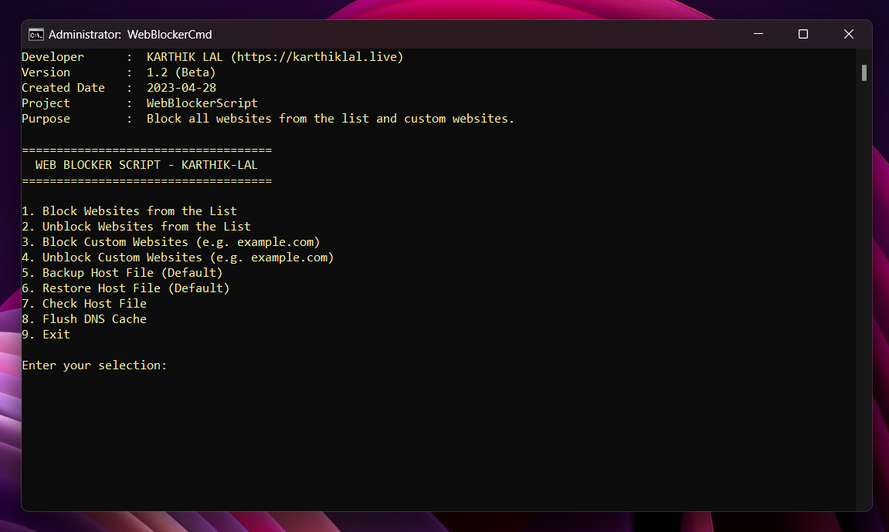
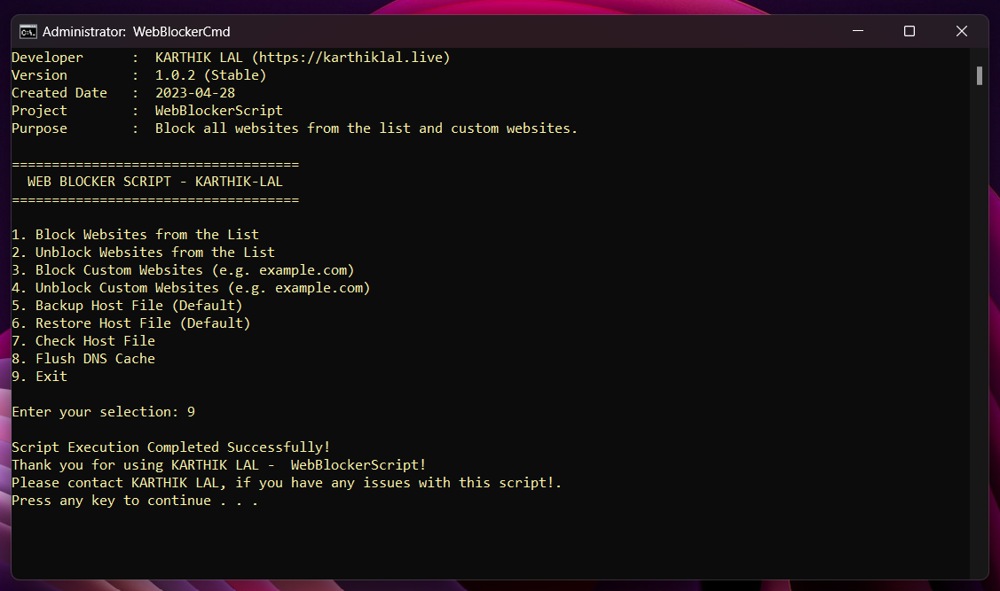

# **WebBlockerScript / WebBlockerCMD**

<!-- Banner Image-->

## Table of Contents
- [About](#about)
- [Usage](#usage)
- [Overview of the Menu](#overview-of-the-menu)
- [Features](#features)
- [Contribution](#contribution)
- [Developer Information](#developer-information)

## About

WebBlockerScript is a simple command-line tool written in Batch script that allows users to easily block access to specific websites on their Windows computer by modifying the hosts file. This tool provides a user-friendly menu system that allows users to add custom websites to block, remove blocked websites, and even backup and restore their hosts file. It is designed to be easy to use and requires no technical knowledge or expertise to operate. This tool can be useful for parents who want to limit their children's access to certain websites or for anyone who wants to improve their productivity by blocking distracting websites during work hours.

<!-- Script Image-->
<table>
  <tr>
    <td></td>
    <td></td>
  </tr>
</table>

## Usage

- **1. Clone the repository (or download from the releases page)** - `git clone https://github.com/karthik558/WebBlockerScript`
- **2. Run the script as administrator. (Right-click on the script and select "Run as administrator")**
- **3. Select an option from the menu. (1-9)**
- **4. That's it! The script will do the rest.**

## Overview of the Menu
- **1. Block a website** - Blocks all the websites that are stored in the `WebBlockerScript.cmd` file.
- **2. Unblock a website** - Removes all the websites that are stored in the `WebBlockerScript.cmd` file.
- **3. Add a website to block** - Allows you to add a custom website to block.
- **4. Remove a website from block** - Allows you to remove a custom website from block.
- **5. Backup hosts file** - Creates a backup of the current hosts file.
- **6. Restore hosts file** - Restores the hosts file from the backup.
- **7. View host file** - Displays the contents of the hosts file in the notepad.
- **8. Flush DNS cache** - Flushes the DNS cache. (Always recommended after blocking/unblocking a website)
- **9. Exit** - Exits the script.

## Features

- **1. Block access to specific websites on your Windows computer.**
- **2. Add custom websites to block.**
- **3. Remove blocked websites.**
- **4. Backup and restore hosts file.**
- **5. Easy to use menu system.**
- **6. No technical knowledge or expertise required.**
- **7. Free and open-source.**

## Contribution

- **This project is open to contributions. Feel free to open a pull request or an issue if you want to contribute to this project.**
- **If you find any bugs or issues, please report them in the issues section.**

## Developer Information

This project was developed by [KARTHIK LAL](https://github.com/karthik558). You can contact me at [karthiklal@duck.com](mailto:karthiklal@duck.com) for any queries or suggestions.
